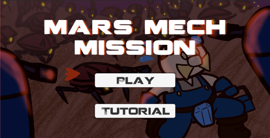

Mars Mech Mission was a game for the final project of the ICS 369 class where each group chose a unique theme for a game, made it, and presented it.

MMM is a top down, 3D and 2D tower defense game where the player defends their home base with different robots and traps. Each day is split into a collection period, a setup/build period, then a wave-like defense period. After each day, more resourses are available to collect to be able to build more defenses and enemies spawn more frequently. When defending, players need to tend to their traps. Whether it be resetting a bear trap or repairing a turret gun, preventing it from overheating.

I created all of the sound effects and the 4 soundtracks that play depending on which phase of the day you are on.
