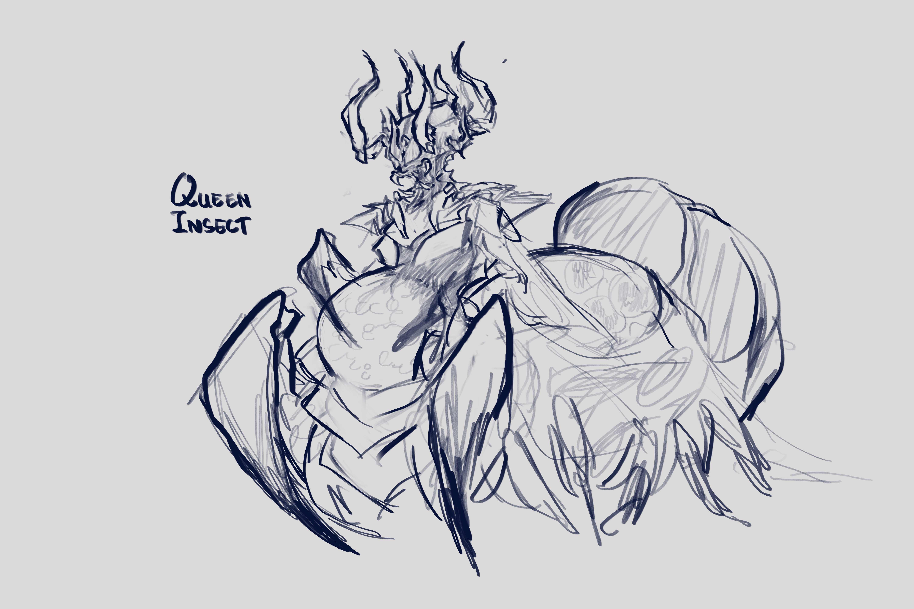

The UHE Game Dev Club is brand new, only being created by my friend and classmate at the ending of the spring 2023 semester. Only made up of 5 members currently, we are looking to possibly expand in the coming future. We are made up of 2 artists, 2 programmers, and 1 programmer/music+sound producer (me).

We are currently working on a top-down horror looter-shooter with an insect theme.

The above picture is a concept art of a boss insect enemy.
